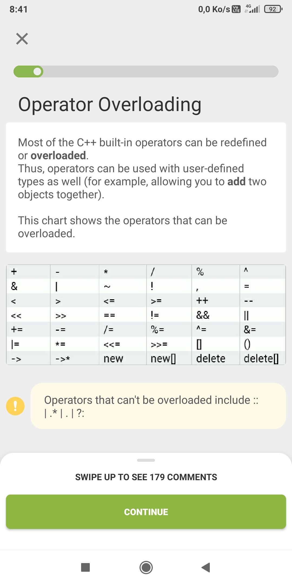

```cpp
MyClass operator+(MyClass &obj) {
   MyClass res;
   res.var= this->var+obj.var;
   return res; 
  }
```
On utiliser l'overloading d'opérateurs sur un objet custom, pas sur les objets de la stl car ça peut casser lors d'une maj

On déclare une fonction dans une classe de telle façon

Cette fonction en exemple permet d'ajouter deux objets MyClass entre eux en additionnant leur variable var

On peut aussi customizer la façon dont marche l’operator pour lui faire faire autre chose exemple :

```cpp
bool operator-(int i){
            cout<<"test"<<endl;
            return true;
        }
```

cant be overriden list : 
.* pointer to member of object
. member of object 
?: 
:: scope operator